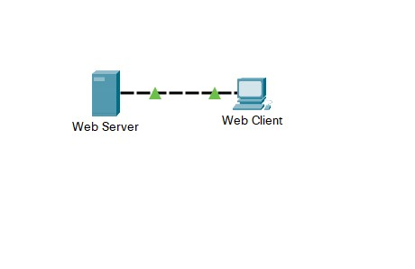

## Week - 2	|  Basic Switch, Router and End Device - Configuration Protocols and Models 

| Module | Picture  |
|--|--|
|2.5.5 Packet Tracer - Configure Initial Switch Settings | |
|2.9.2 Packet Tracer - Basic Switch and End Device Configuration - Physical Mode | |
|3.5.5 Packet Tracer - Investigate the TCP-IP and OSI Models in Action | |