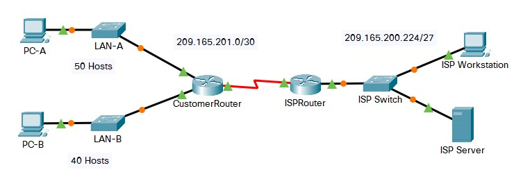

## Week - 6	| Ip Addressing and ICMP

| Module | Picture  |
|--|--|
|11.5.5 - Subnet an IPv4 Network| |
|11.7.5 - Subnetting Scenario | |
|11.9.3 - VLSM Design and Implementation Practice| |
|11.10.1 - Design and Implement a VLSM Addressing Scheme| |
|12.6.6 - Configure IPv6 Addressing| |
|12.9.1 - Implement a Subnetted IPv6 Addressing Scheme| |
|13.2.6 - Verify IPv4 and IPv6 Addressing| |
|13.2.7 - Use Ping and Traceroute to Test Network Connectivity| |
|13.3.1 - Use ICMP to Test and Correct Network Connectivity| |

