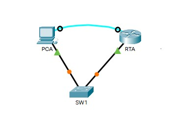
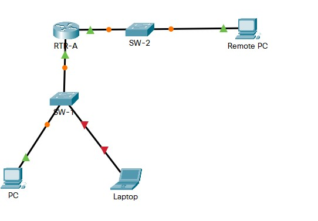
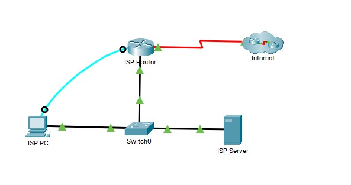
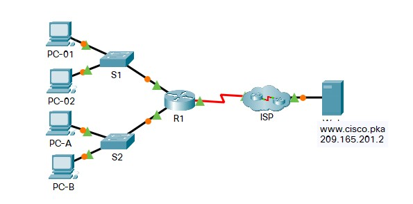
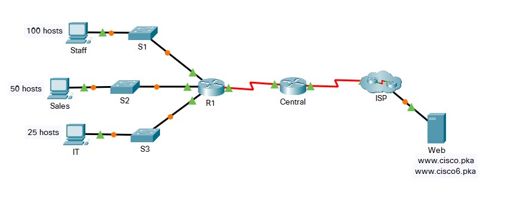
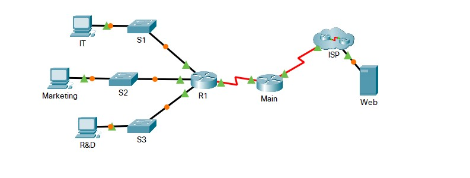

## Week - 7 | Network Security 

| Module | Picture  |
|--|--|
|16.4.6 - Configure Secure Passwords and SSH | |
|16.5.1 - Secure Network Devices | |
|17.5.9 - Interpret show Command Output| |
|17.7.7 - Troubleshoot Connectivity Issues| |
|17.8.2 - Skills Integration Challenge| |
|17.8.3 - Troubleshooting Challenge| |

