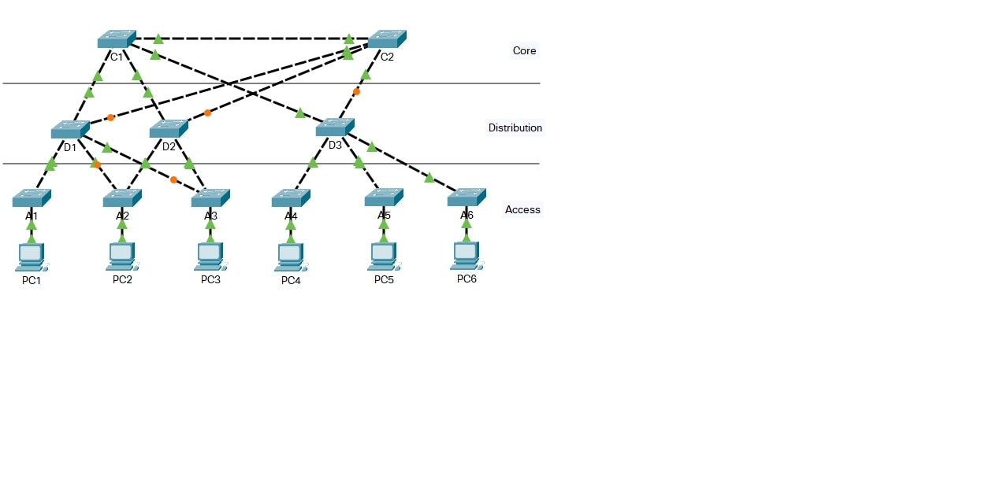
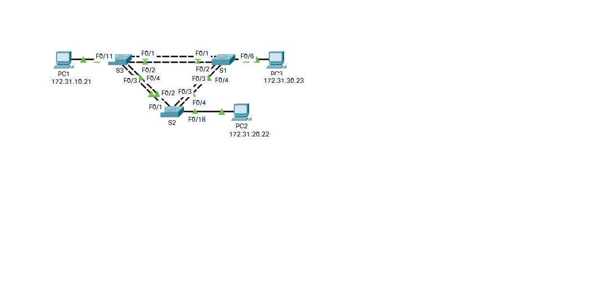
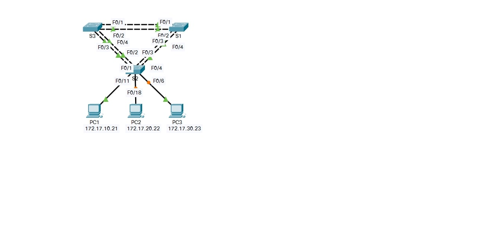
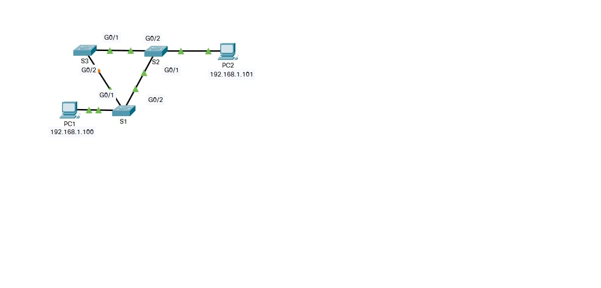

## Week - 10 STP

| Module | Picture  |
|--|--|
|3.1.1.5 Packet Tracer - Examining a Redundant Design | |
|3.3.1.5 Packet Tracer - Configuring PVST | |
|3.3.2.2 Packet Tracer - Configuring Rapid PVST | |
|5.1.9 Packet Tracer - Investigate STP Loop Prevention | |

