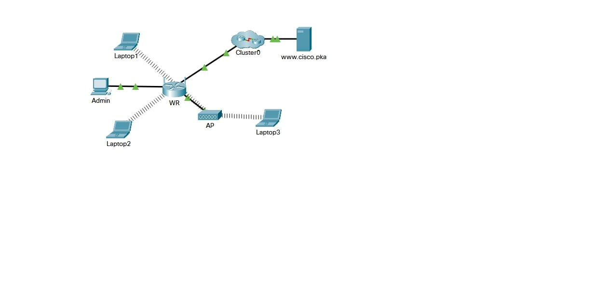
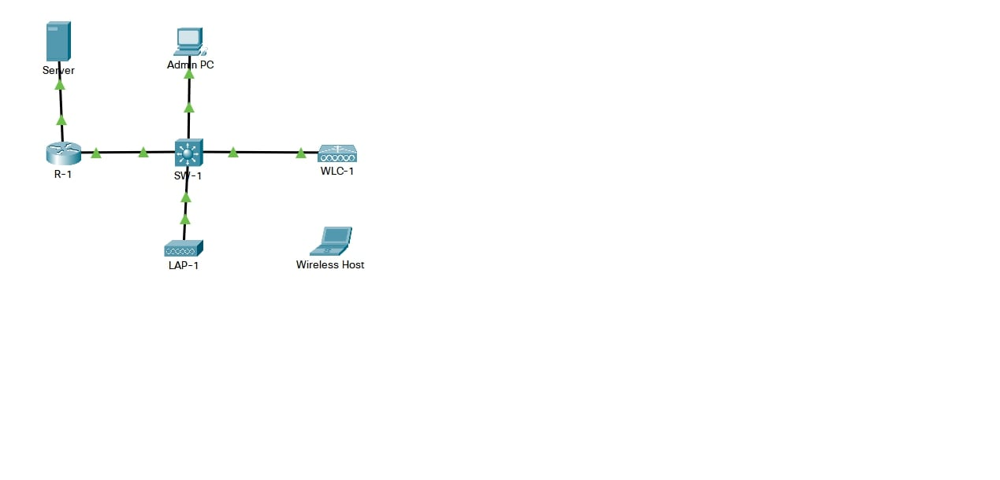
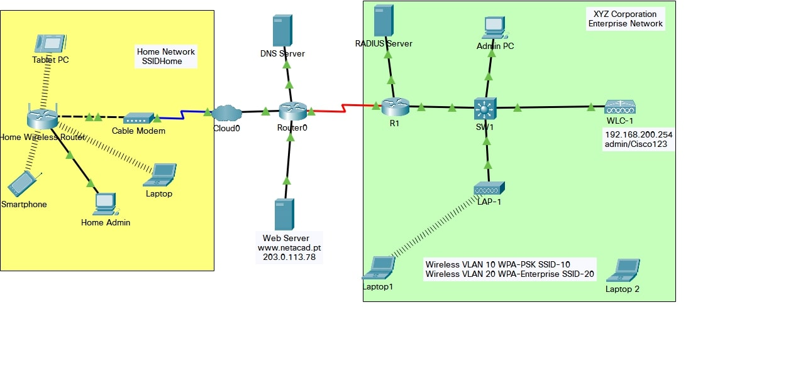
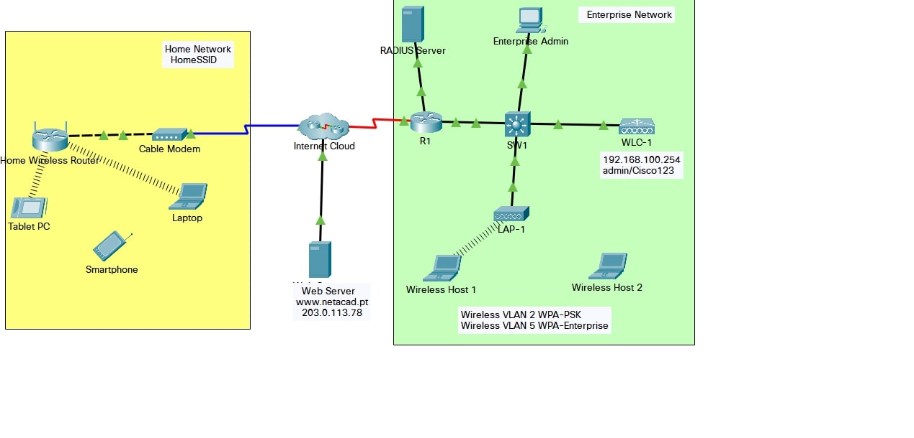
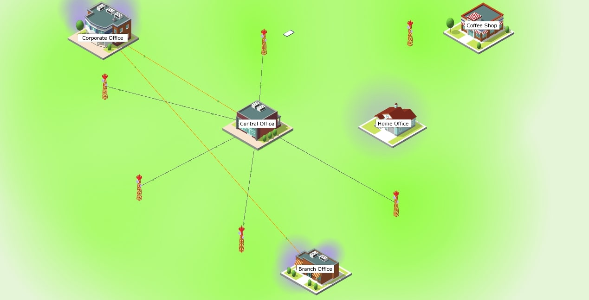

## Week - 14 WLAN

| Module | Picture  |
|--|--|
|13.1.10 - Configure a wireless network | |
|13.2.7 - Configure a basic Wlan on the wlc | |
|13.4.5 - Troubleshoot Wlan Issues | |
|13.5.1 - Wlan Configuration | |
|13.5.2 - Wireless Technology Exploration---physical-mode | |
|13.4.5 - Troubleshoot-wlan-issues | |
|13.5.1 - Wlan-configuration | |
|13.5.2 - Wireless Technology Exploration---physical-mode | |

