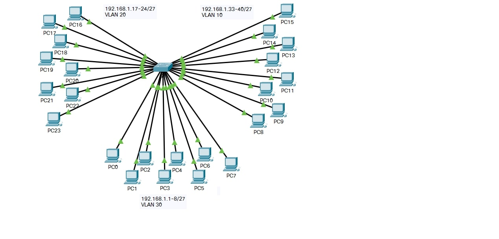
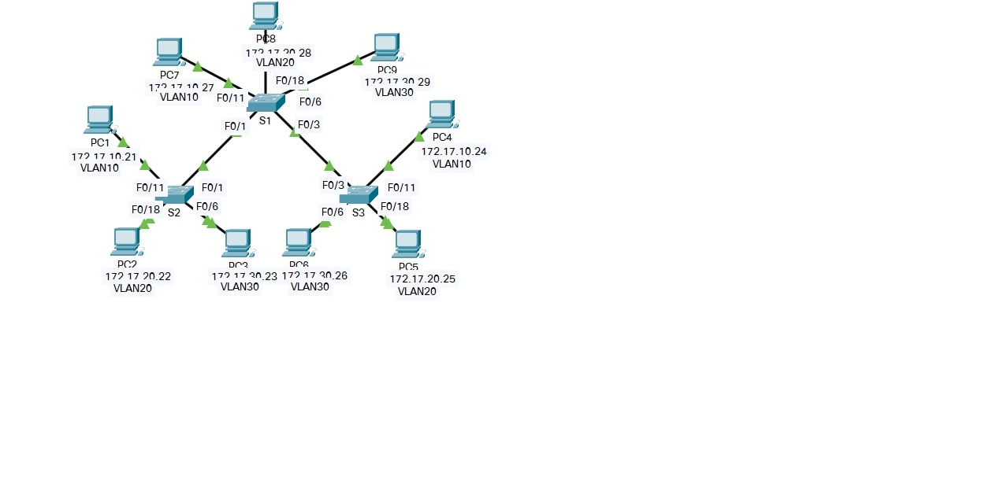
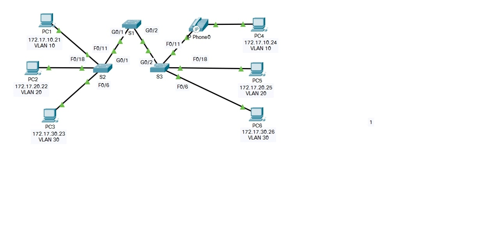
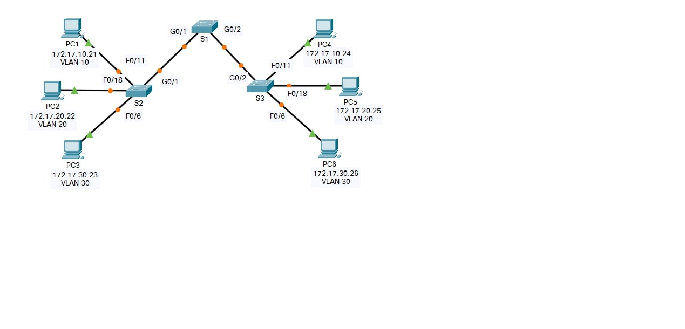
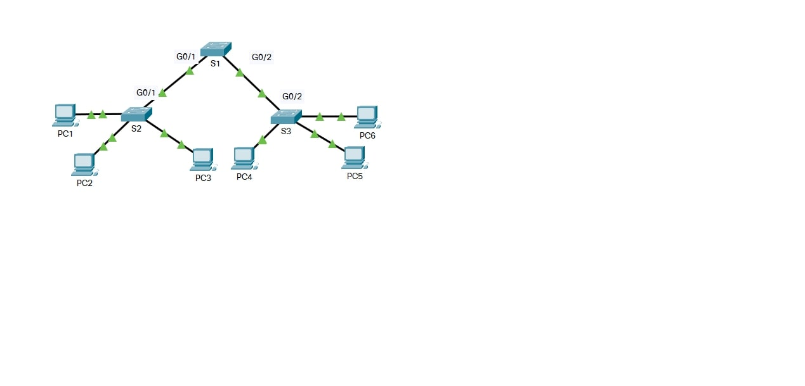
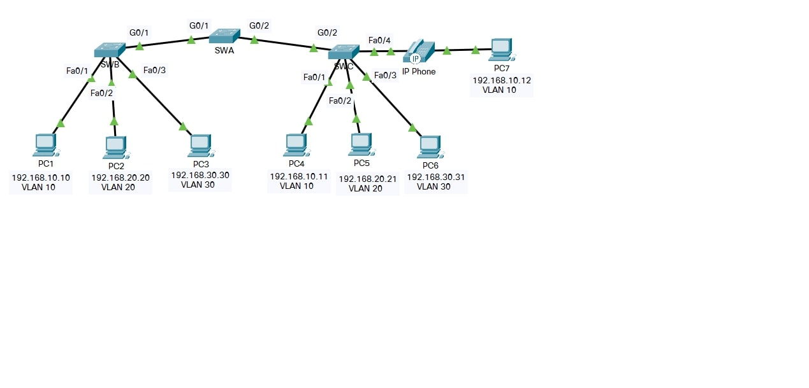
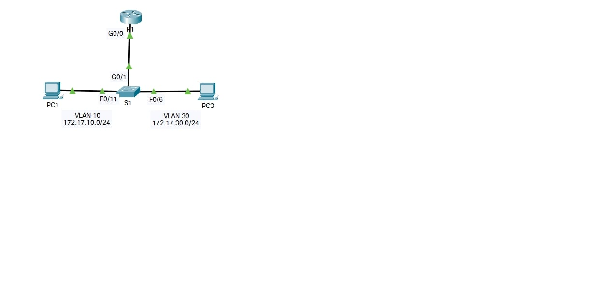
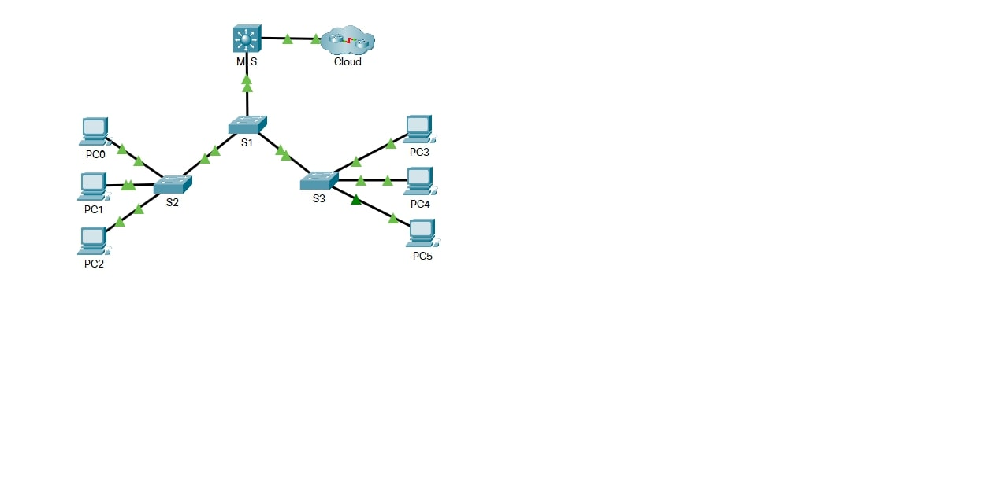
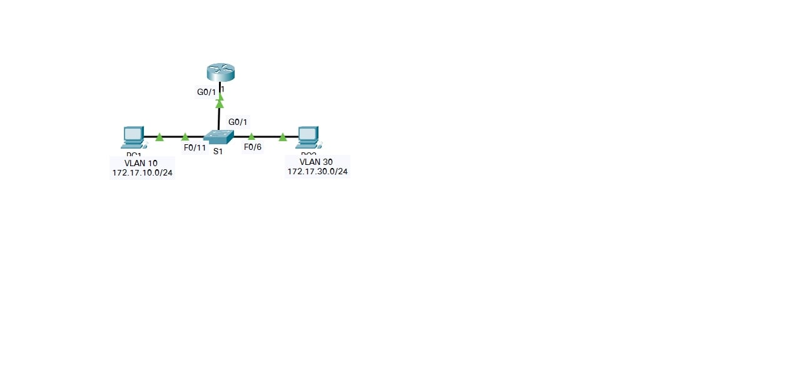
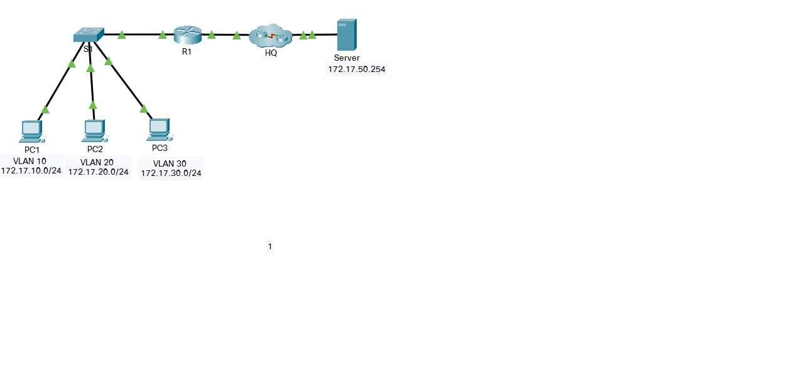

## Week - 9 Swiching Concepts. Vlan, inter-VLAN Routing

| Module | Picture  |
|--|--|
|3.1.4 - Who Hears the Broadcast | |
|3.2.8 - Investigate a VLAN Implementation | |
|3.3.12 - VLAN Configuration | |
|3.4.5 - Configure Trunks | |
|3.5.5 - Configure DTP | |
|3.6.1 - Implement VLANs and Trunking | |
|4.2.7 - Configure Router-on-a-Stick Inter-VLAN Routing | |
|4.3.8 - Configure Layer 3 Switching and Inter-VLAN Routing | |
|4.4.8 - Troubleshoot Inter-VLAN Routing | |
|4.5.1 - Inter-VLAN Routing Challenge | |

